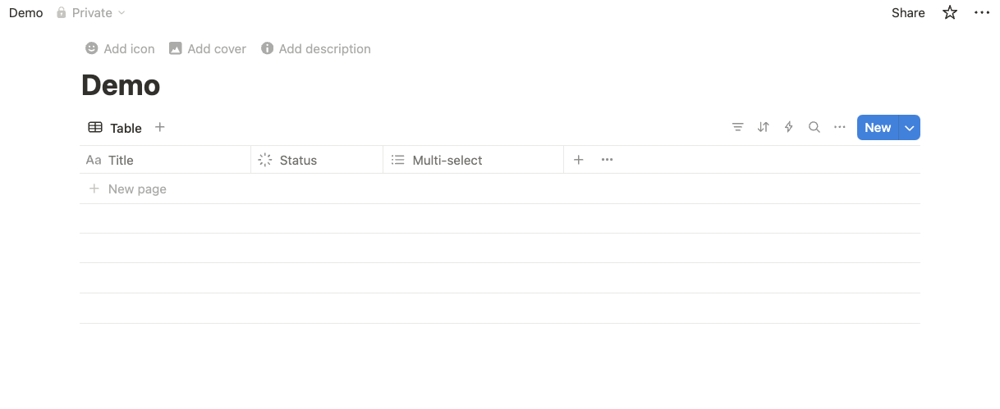

  <picture>
    <source media="(prefers-color-scheme: dark)" srcset="./public/logo-dark.png">
    <source media="(prefers-color-scheme: light)" srcset="./public/logo-light.png">
    
  </picture>

  <!-- Made with TypeScript -->
  
  <!-- License -->
  
  <!-- Cloudflare Workers -->
  
  <!-- iOS Shortcuts -->
  
  <!-- Raycast -->
  

<h1 align="left">Instant Bookmark </h1>

**Never miss any inspirations even in multi-tasking. Save anything to Notion, instantly. From anywhere.**

Instant Bookmark is a service to quickly save URLs and screenshots to Notion, with support for web, iOS Shortcuts, and Raycast. It leverages Cloudflare Workers for backend processing and a Vite-based React frontend.

## Demo

  
Watch Demo Videos

  
  ### Raycast - Image
  <video controls src="https://github.com/user-attachments/assets/a20ce3b3-37a6-4a1d-a00c-e92ebee2b789" width="600"></video>
  
  ### iOS Shortcut - Screenshot
  <video controls src="https://github.com/user-attachments/assets/77164d27-2f7b-46ae-9c2c-a3878a5ebcb1" width="600"></video>
  
  ### iOS Shortcut - Web URL
  <video controls src="https://github.com/user-attachments/assets/3313cd82-6712-4647-b55a-2998c6751aa8" width="600"></video>
  
  ### Web UI - URL Saving
  <video controls src="https://github.com/user-attachments/assets/8a19c0b5-7abd-4e4a-9153-dbcf21f378d8" width="600"></video>

## Tech Stack

*   **Frontend**: React, TypeScript, Vite, Tailwind CSS
*   **Backend**: Cloudflare Workers (TypeScript)
*   **Browser Automation**: Browserless (for tasks requiring a headless browser, like advanced URL processing or screenshot)
*   **Primary Integration**: Notion API
*   **Client Integrations**: iOS Shortcuts, Raycast

## Key Features

*   Save URLs or screenshots to Notion from anywhere: using the gateway url, iOS shortcut, or use Raycast Extension.
*   Optionally auto summarize URLs/screenshot using cost-effective GPT-4.1-nano.
*   Secure API for client communication.
*   Free, Easy deployment via Cloudflare Workers and Browserless.

## Getting Started

### Prerequisites

To get started, you need to prepare a Notion database that is accessible programmatically:
*   A Notion account
*   A Notion database set up for Instant Bookmark with the following attributes (case-sensitive):
    - Title (rename the default Name column)
    - Status (default setting)
    - Tags (use Multi-select)
 

* Notion integration token (requested from [Notion dev portal](https://developers.notion.com/)). Here's [the official guide](https://developers.notion.com/docs/create-a-notion-integration#getting-started) if you are unfamiliar with it, you only need to follow the #getting-started section and complete the page permission grant

### Choose your setup path:
*   For local development (if you want to continue the development and make changes), see [LOCAL_DEVELOPMENT.md](./docs/LOCAL_DEVELOPMENT.md)
*   For deployment (if you just want this to work), see [DEPLOYMENT.md](./docs/DEPLOYMENT.md)

## iOS Shortcut and Raycast Integrations
See README.md from clients/ folder to set up the integrations
*   [iOS Shortcut Integration](./clients/ios-shortcut/README.md)
*   [Raycast Extension Integration](./clients/raycast/README.md)

## Backend API Endpoints

*   **`/api/ingest`**: Main entry point that accepts both URL and image data. For URLs, it fetches content and generates summaries using AI. For images, it processes screenshots using AI vision models. Supports both auto-generated and manual titles/summaries.
*   **`/api/process-url`**: Internal endpoint that accepts a URL, uses Browserless.io to extract content, and returns AI-generated title and summary.
*   **`/api/process-screenshot`**: Internal endpoint that accepts an image file, uploads it to Notion, processes it with AI vision, and returns the title, summary, and Notion upload ID.
*   **`/api/save-to-notion`**: Internal endpoint that accepts processed data (title, summary, source type, URL/upload ID) and saves it to the configured Notion database.

## Technical Notes

### `playwright-mcp` and Cloudflare Workers

An attempt was made to use `playwright-mcp` for advanced browser automation tasks, potentially for more robust URL processing or screenshot generation. However, this approach was found to be incompatible with the Cloudflare Workers environment.

*   **Reason**: Cloudflare Workers have a restricted runtime environment that does not allow the spawning of child processes (`child_process.spawn`), which is a capability `playwright-mcp` relies on to control a browser instance. This limitation is in place for security and resource management reasons within the serverless environment.
*   **Alternative**: To handle browser automation tasks like rendering JavaScript-heavy sites or backend screenshots, this project uses [Browserless.io](https://www.browserless.io/). Cloudflare Workers call the Browserless API, leveraging its remote headless browsers (free tier available) for complex URL processing and screenshot. This bypasses Worker limitations while still enabling full browser capabilities when needed. Simpler content fetching uses standard `fetch`. Clients can also directly upload screenshots.

## Completely vibe coded
This project is made possible thanks to [bolt](https://bolt.new/) for the prototype on FE and [cursor](https://www.cursor.com/) for the BE.