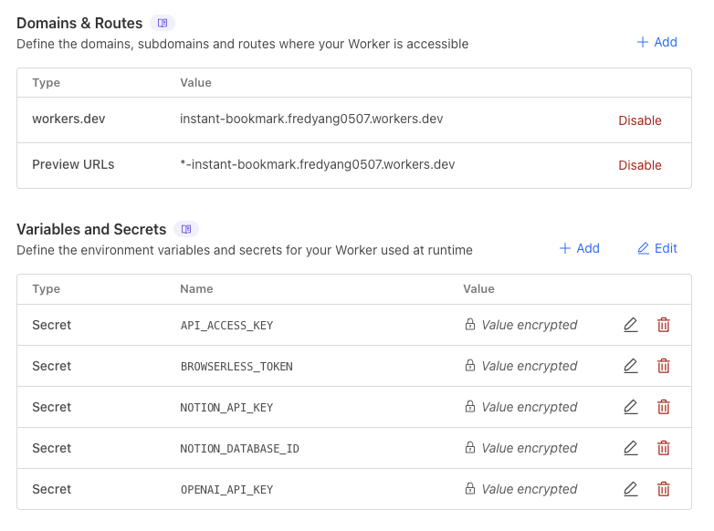

<p align="center">
  <picture>
    <source media="(prefers-color-scheme: dark)" srcset="./public/logo-dark.png">
    <source media="(prefers-color-scheme: light)" srcset="./public/logo-light.png">
    
  </picture>
</p>

<p align="center">
  <!-- Made with TypeScript -->
  
  <!-- License -->
  
  <!-- Cloudflare Workers -->
  
  <!-- iOS Shortcuts -->
  
  <!-- Raycast -->
  
</p>


<h1 align="left">Instant Bookmark </h1>

**Never miss any inspirations even in multi-tasking. Save anything to Notion, instantly. From anywhere.**

Instant Bookmark is a service to quickly save URLs and screenshots to Notion, with support for web, iOS Shortcuts, and Raycast. It leverages Cloudflare Workers for backend processing and a Vite-based React frontend.

## Demo

<details>
  <summary>Watch Demo Videos</summary>
  
  ### Raycast - Image
  <video controls src="https://github.com/user-attachments/assets/a20ce3b3-37a6-4a1d-a00c-e92ebee2b789" width="600"></video>
  
  ### iOS Shortcut - Screenshot
  <video controls src="https://github.com/user-attachments/assets/77164d27-2f7b-46ae-9c2c-a3878a5ebcb1" width="600"></video>
  
  ### iOS Shortcut - Web URL
  <video controls src="https://github.com/user-attachments/assets/3313cd82-6712-4647-b55a-2998c6751aa8" width="600"></video>
  
  ### Web UI - URL Saving
  <video controls src="https://github.com/user-attachments/assets/8a19c0b5-7abd-4e4a-9153-dbcf21f378d8" width="600"></video>
</details>

## Tech Stack

*   **Frontend**: React, TypeScript, Vite, Tailwind CSS
*   **Backend**: Cloudflare Workers (TypeScript)
*   **Browser Automation**: Browserless (for tasks requiring a headless browser, like advanced URL processing or screenshot)
*   **Primary Integration**: Notion API
*   **Client Integrations**: iOS Shortcuts, Raycast

## Key Features

*   Save URLs or screenshots to Notion from anywhere: using the gateway url, iOS shortcut, or use Raycast Extension.
*   Optionally auto summarize URLs/screenshot using cost-effective GPT-4.1-nano.
*   Secure API for client communication.
*   Free, Easy deployment via Cloudflare Workers and Browserless.

## Getting Started

### Prerequisites

*   Node.js and npm 
*   Install npm (recommended to install via `brew` use `brew install node`, if you don't have brew, follow [this guide](https://brew.sh/))
*   Wrangler CLI: `npm install -g wrangler`
*   A Notion account and an integration token (requested from [Notion dev portal](https://developers.notion.com/)).
*   A Notion database set up for bookmarks, it needs to have the following attributes: Title (text), Status (default setting) and Tags (Multi-select).

### Local Development Setup (skip to Deployment section if you don't want to change anything)

1.  **Clone the repository:**
    ```bash
    git clone https://github.com/fyang0507/instant-bookmark.git
    cd instant-bookmark
    ```

2.  **Install dependencies:**
    ```bash
    npm install
    ```

3.  **Configure Environment Variables:**

    *   **For Cloudflare Functions (Backend):**
        Create a `.dev.vars` file in the project root (and add it to `.gitignore`). This file will hold secrets for your local Cloudflare Functions development.
        ```ini
        NOTION_API_KEY="your_notion_api_key" # request from: https://developers.notion.com/
        NOTION_DATABASE_ID="your_notion_database_id" # see this guide to retrieve the ID: https://developers.notion.com/reference/retrieve-a-database
        API_ACCESS_KEY="your_secure_local_api_key_for_backend" # generate yourself, e.g. you can use `openssl rand -hex 32`
        OPENAI_API_KEY="your_openai_api_key" # requested from https://platform.openai.com/
        BROWSERLESS_TOKEN="your_browserless_token" # sign up on https://www.browserless.io/ to get the token
        ```

    *   **For Vite Frontend:**
        Create a `.env` file in the project root (and add it to `.gitignore`). This file will hold variables for your local Vite frontend development.
        ```ini
        VITE_API_ACCESS_KEY="your_secure_local_api_key_for_frontend" # Should be the same as API_ACCESS_KEY in .dev.vars
        ```
        **Note:** The `API_ACCESS_KEY` in `.dev.vars` and `VITE_API_ACCESS_KEY` in `.env` must be the same for the frontend to authenticate with the backend services.

4.  **Run the development server:**
    Wrangler is used to serve both the frontend and the Cloudflare Functions locally.
    ```bash
    wrangler pages dev -- npm run dev
    ```
    This command makes variables from `.dev.vars` available to your functions, and Vite uses variables from `.env` for the frontend. The application will typically be available at `http://localhost:5173/`.

### API Authentication

All backend Cloudflare Worker functions (under `functions/api/`) expect an `API_ACCESS_KEY` to be sent in the `X-API-Key` request header. The backend validates this key against the `API_ACCESS_KEY` secret defined in its environment. Requests with missing or invalid keys will be rejected.

You can generate a secure API key for your application using OpenSSL: `openssl rand -hex 32`


## Deployment to Cloudflare Workers

1. **Prepare Your Repository**:
   - Ensure your code is pushed to a GitHub repository (or you fork this repo to your account)

2. **Deploy via Cloudflare Workers**:
   - Go to [Cloudflare Dashboard](https://dash.cloudflare.com)
   - Navigate to "Workers & Pages" in the sidebar
   - Click "Create application"
   - Select "Create Worker"
   - Choose "Deploy from GitHub"
   - Select your repository
   - Configure build settings:
     - Build command: `npm run build`
     - Deploy command: `npx wrangler deploy`
     - Path: `/`

3. **Configure Environment Variables**:
   - In your Worker's dashboard
   - Go to "Settings" > "Variables"
   - Add the following variables:
     ```ini
     NOTION_API_KEY  # request from: https://developers.notion.com/
     NOTION_DATABASE_ID # see this guide to retrieve the ID: https://developers.notion.com/reference/retrieve-a-database
     API_ACCESS_KEY  # generate yourself, e.g. you can use `openssl rand -hex 32`
     OPENAI_API_KEY # requested from https://platform.openai.com/
     BROWSERLESS_TOKEN # sign up on https://www.browserless.io/ to get the token
     ```
   - Go to "Settings" > "Build" > "Variables and secrets"
   - Add the following variables:
     ```ini
     VITE_API_ACCESS_KEY # the same as API_ACCESS_KEY, this ensures the Front End webpage can connect to the Back End API
     ```

4. **Verify Deployment**:
   - Check the deployment status in the Workers dashboard
   - Test all API endpoints with your API key
   - Verify Notion integration is working
   - Test URL processing and screenshot functionality

Here's the reference for Cloudflare configuration.



## iOS Shortcut and Raycast Integrations
See README.md from clients/ folder to set up the integrations

## Backend API Endpoints

*   **`/api/ingest`**: Main entry point that accepts both URL and image data. For URLs, it fetches content and generates summaries using AI. For images, it processes screenshots using AI vision models. Supports both auto-generated and manual titles/summaries.
*   **`/api/process-url`**: Internal endpoint that accepts a URL, uses Browserless.io to extract content, and returns AI-generated title and summary.
*   **`/api/process-screenshot`**: Internal endpoint that accepts an image file, uploads it to Notion, processes it with AI vision, and returns the title, summary, and Notion upload ID.
*   **`/api/save-to-notion`**: Internal endpoint that accepts processed data (title, summary, source type, URL/upload ID) and saves it to the configured Notion database.

## Technical Notes

### `playwright-mcp` and Cloudflare Workers

An attempt was made to use `playwright-mcp` for advanced browser automation tasks, potentially for more robust URL processing or screenshot generation. However, this approach was found to be incompatible with the Cloudflare Workers environment.

*   **Reason**: Cloudflare Workers have a restricted runtime environment that does not allow the spawning of child processes (`child_process.spawn`), which is a capability `playwright-mcp` relies on to control a browser instance. This limitation is in place for security and resource management reasons within the serverless environment.
*   **Alternative**: To handle browser automation tasks like rendering JavaScript-heavy sites or backend screenshots, this project uses [Browserless.io](https://www.browserless.io/). Cloudflare Workers call the Browserless API, leveraging its remote headless browsers (free tier available) for complex URL processing and screenshot. This bypasses Worker limitations while still enabling full browser capabilities when needed. Simpler content fetching uses standard `fetch`. Clients can also directly upload screenshots.

## Completely vibe coded
This project is made possible thanks to [bolt](https://bolt.new/) for the prototype on FE and [cursor](https://www.cursor.com/) for the BE.