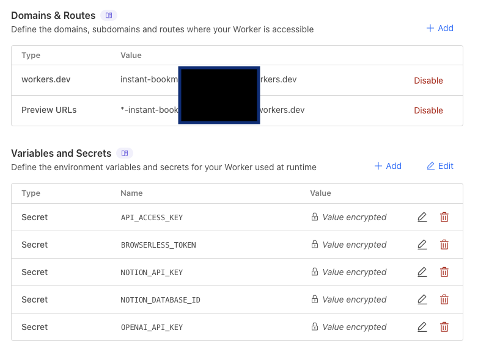
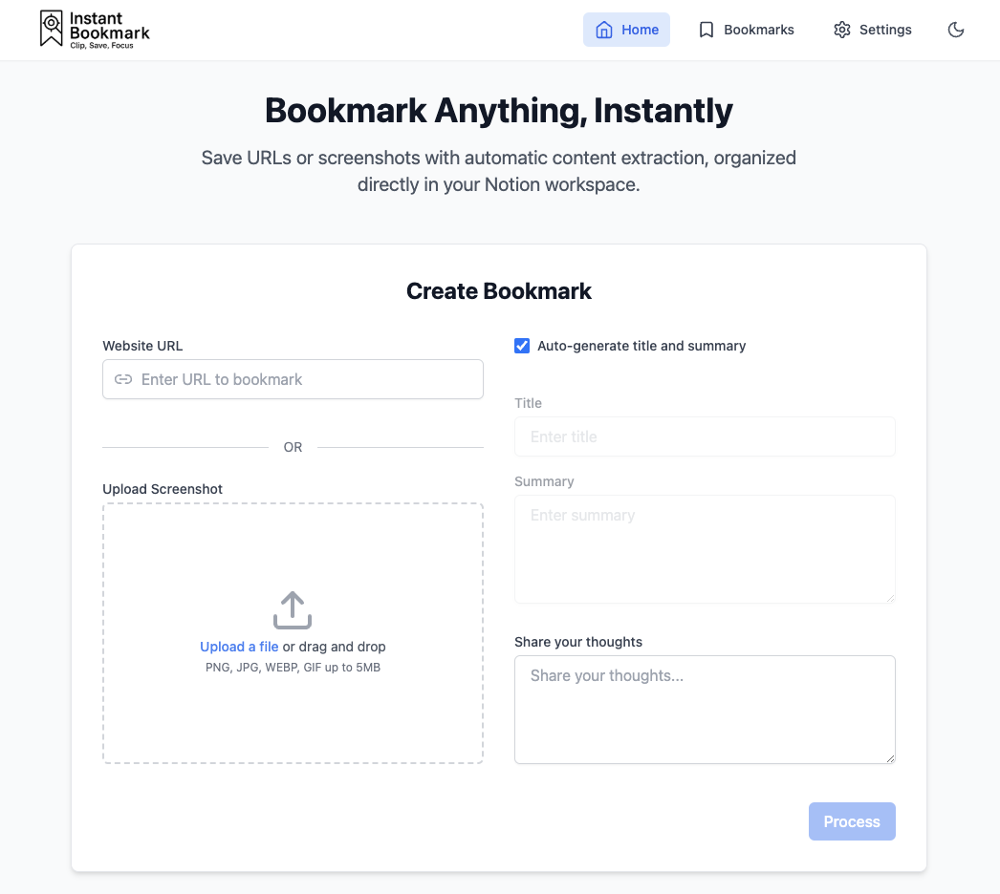

## Deployment to Cloudflare Workers

1. **Prepare Your Repository**:
   - You can choose to
     - Directly use this repo (aka. no nothing, but running the risk of stay connected to my repo which is subject to future disruptive changes)
     - Fork this repo to your account (**recommended**, a frozen version that works)
     - Follow [local development guide](LOCAL_DEVELOPMENT.md), create your own, and publish to your account

2. **Deploy via Cloudflare Workers**:
   - Go to [Cloudflare Dashboard](https://dash.cloudflare.com)
   - On the top right, click the "+Add" button
   - Select "Workers"
   - Choose "Import a repository"
     - You need to link your GitHub account first
     - If you forked or have published to your own account, you can choose your own instance
     - Otherwise, use the "Clone a public repository via Git URL" and use my repo
   - Select your repository
   - Configure/check build settings:
     - Build command: `npm run build`
     - Deploy command: `npx wrangler deploy`

3. **Configure Environment Variables**:
   - In your Worker's dashboard
   - Go to "Settings" > "Variables"
   - Add the following variables (remember to choose the type to "Secret"):
      ```ini
      NOTION_API_KEY=your_notion_api_key # request from: https://developers.notion.com/
      NOTION_DATABASE_ID=your_notion_database_id # see this guide to retrieve the ID: https://developers.notion.com/reference/retrieve-a-database
      API_ACCESS_KEY=your_secure_local_api_key_for_backend # generate yourself, e.g. you can use `openssl rand -hex 32`
      OPENAI_API_KEY=your_openai_api_key # requested from https://platform.openai.com/
      BROWSERLESS_TOKEN=your_browserless_token # sign up on https://www.browserless.io/ to get the token
      ```
   - Go to "Settings" > "Build" > "Variables and secrets"
   - Add the following variables:
     ```ini
     VITE_API_ACCESS_KEY # the same as API_ACCESS_KEY, this ensures the Front End webpage can connect to the Back End API
     ```
    - Here's the reference for Cloudflare configuration:
 

4. **Force Rebuild**
   - Go to "Deployment" tab
   - Click "View build" for the most recent deployment
   - In "Build details", click "Retry build"
   - This is necessary because your newly added `VITE_API_ACCESS_KEY` is not incorporated in the first build

5. **Verify Deployment**:
   - Check the deployment status in the Workers dashboard
   - In the "Settings" > "Domain & Routes", the url in the `workers.dev` row is the web UI
   - The landing page will look like this: 
   - And yes, it's fully functioning! Happy bookmarking!


6. **(Optional) Add Integrations**
   - Don't think a web UI is native enough to your OS? Check out and set up your [Raycast](../clients/raycast-extension/README.md) and [iOS Shortcut](../clients/ios-shortcut/README.md) integrations! 